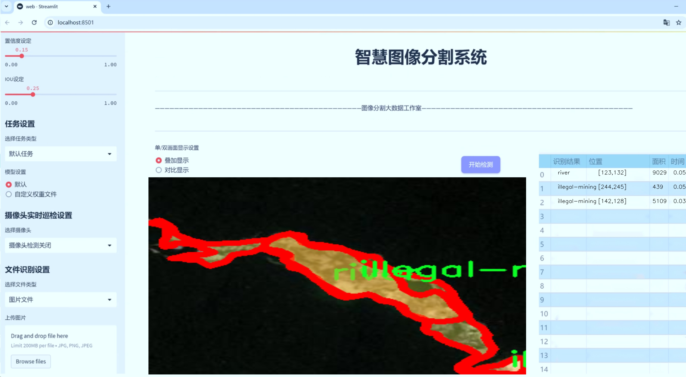

# 非法采矿区域分割系统： yolov8-seg-timm

### 1.研究背景与意义

[参考博客](https://gitee.com/YOLOv8_YOLOv11_Segmentation_Studio/projects)

[博客来源](https://kdocs.cn/l/cszuIiCKVNis)

研究背景与意义

随着全球经济的快速发展，非法采矿活动日益猖獗，给生态环境和社会经济带来了严重的负面影响。非法采矿不仅破坏了自然资源的可持续利用，还导致了水土流失、生态系统退化以及生物多样性的减少。尤其是在一些发展中国家，非法采矿往往与贫困、失业和社会不稳定密切相关，形成了一个复杂的社会经济问题。因此，针对非法采矿的监测与管理显得尤为重要。传统的人工监测方法效率低下，难以满足日益增长的监测需求，而基于计算机视觉和深度学习的自动化监测系统则为解决这一问题提供了新的思路。

在此背景下，YOLO（You Only Look Once）系列目标检测算法因其高效性和实时性，成为了计算机视觉领域的重要研究方向。YOLOv8作为该系列的最新版本，结合了多种先进的深度学习技术，具有更强的特征提取能力和更高的检测精度。然而，针对非法采矿区域的分割任务，YOLOv8仍然面临着一些挑战，例如在复杂背景下的目标识别、不同尺度目标的检测以及多类别目标的精确分割等。因此，改进YOLOv8以适应非法采矿区域的特定需求，具有重要的理论价值和实际意义。

本研究旨在基于改进的YOLOv8模型，构建一个针对非法采矿区域的分割系统。我们将利用一个包含1100幅图像的数据集，该数据集分为三类：非法采矿、河流和有毒水池。这些类别不仅涵盖了非法采矿活动的主要特征，还反映了其对周边环境的影响。通过对这些图像的深入分析与处理，我们期望能够实现对非法采矿区域的高效分割与识别，为后续的监测与管理提供数据支持。

本研究的意义在于，首先，通过改进YOLOv8模型，我们将提升非法采矿区域的检测精度和分割效果，为相关部门提供更加准确的监测工具。其次，基于实例分割的技术，可以帮助决策者更好地理解非法采矿对环境的影响，从而制定更为有效的治理措施。此外，本研究还将为计算机视觉领域的实例分割技术提供新的应用案例，推动该领域的进一步发展。

综上所述，基于改进YOLOv8的非法采矿区域分割系统的研究，不仅具有重要的学术价值，也对实际环境保护和资源管理具有深远的影响。通过有效的监测与管理，我们希望能够为保护生态环境、促进可持续发展贡献一份力量。

### 2.图片演示





注意：本项目提供完整的训练源码数据集和训练教程,由于此博客编辑较早,暂不提供权重文件（best.pt）,需要按照6.训练教程进行训练后实现上图效果。

### 3.视频演示

[3.1 视频演示](https://www.bilibili.com/video/BV1bSzmYpE3T/)

### 4.数据集信息

##### 4.1 数据集类别数＆类别名

nc: 3
names: ['illegal-mining', 'river', 'toxic-pool']


##### 4.2 数据集信息简介

数据集信息展示

在现代环境监测与保护领域，非法采矿活动的检测与管理日益受到重视。为此，我们构建了一个名为“Segmentation illegal mining”的数据集，旨在为改进YOLOv8-seg模型提供高质量的训练数据，进而实现对非法采矿区域的精准分割。该数据集专注于三个主要类别，分别是“illegal-mining”（非法采矿）、“river”（河流）和“toxic-pool”（有毒水池），通过对这些类别的细致标注，旨在提升模型在复杂环境下的分割能力。

该数据集的设计考虑了多样性与代表性，涵盖了不同地理区域、气候条件和采矿方式下的非法采矿场景。数据集中包含的图像均为高分辨率，确保了细节的清晰可辨，便于模型学习到更为精确的特征。通过多种拍摄角度和时间段的采集，数据集有效地反映了非法采矿活动的动态变化，尤其是在雨季和干旱季节的不同表现。这种多样性不仅增强了模型的泛化能力，也为后续的研究提供了丰富的基础数据。

在类别标注方面，数据集中的“illegal-mining”类别主要指代那些明显的非法采矿活动区域，这些区域通常伴随着土地的破坏、植被的消失以及周边环境的污染。通过对这些区域的精确标注，模型能够学习到非法采矿活动的特征，从而在实际应用中有效识别和监测此类行为。

“river”类别则代表了数据集中河流的区域，这一类别的标注不仅有助于区分水体与非法采矿区域，还能为模型提供背景信息，以便更好地理解和识别周围环境的关系。河流的存在往往与非法采矿活动密切相关，因此对其进行准确的分割是实现全面监测的关键。

“toxic-pool”类别则聚焦于那些因非法采矿活动而形成的有毒水池。这些水池通常含有重金属和其他有害物质，对生态环境和人类健康构成严重威胁。通过对这些有毒水池的标注，数据集不仅帮助模型识别潜在的环境风险，还为后续的环境治理提供了重要依据。

在数据集的构建过程中，我们还特别注重数据的平衡性与完整性，确保每个类别的样本数量相对均衡，以避免模型在训练过程中出现偏倚。此外，数据集还经过严格的质量控制，确保标注的准确性和一致性，从而为模型的训练提供可靠的基础。

综上所述，“Segmentation illegal mining”数据集不仅为改进YOLOv8-seg模型提供了丰富的训练素材，也为非法采矿活动的监测与治理奠定了坚实的基础。通过对该数据集的深入研究与应用，我们期望能够推动环境保护技术的发展，为实现可持续的生态环境贡献力量。


### 5.项目依赖环境部署教程（零基础手把手教学）

[5.1 环境部署教程链接（零基础手把手教学）](https://www.bilibili.com/video/BV1jG4Ve4E9t/?vd_source=bc9aec86d164b67a7004b996143742dc)


[5.2 安装Python虚拟环境创建和依赖库安装视频教程链接（零基础手把手教学）](https://www.bilibili.com/video/BV1nA4VeYEze/?vd_source=bc9aec86d164b67a7004b996143742dc)

### 6.手把手YOLOV8-seg训练视频教程（零基础手把手教学）

[6.1 手把手YOLOV8-seg训练视频教程（零基础小白有手就能学会）](https://www.bilibili.com/video/BV1cA4VeYETe/?vd_source=bc9aec86d164b67a7004b996143742dc)


按照上面的训练视频教程链接加载项目提供的数据集，运行train.py即可开始训练



     Epoch   gpu_mem       box       obj       cls    labels  img_size
     1/200     0G   0.01576   0.01955  0.007536        22      1280: 100%|██████████| 849/849 [14:42<00:00,  1.04s/it]
               Class     Images     Labels          P          R     mAP@.5 mAP@.5:.95: 100%|██████████| 213/213 [01:14<00:00,  2.87it/s]
                 all       3395      17314      0.994      0.957      0.0957      0.0843

     Epoch   gpu_mem       box       obj       cls    labels  img_size
     2/200     0G   0.01578   0.01923  0.007006        22      1280: 100%|██████████| 849/849 [14:44<00:00,  1.04s/it]
               Class     Images     Labels          P          R     mAP@.5 mAP@.5:.95: 100%|██████████| 213/213 [01:12<00:00,  2.95it/s]
                 all       3395      17314      0.996      0.956      0.0957      0.0845

     Epoch   gpu_mem       box       obj       cls    labels  img_size
     3/200     0G   0.01561    0.0191  0.006895        27      1280: 100%|██████████| 849/849 [10:56<00:00,  1.29it/s]
               Class     Images     Labels          P          R     mAP@.5 mAP@.5:.95: 100%|███████   | 187/213 [00:52<00:00,  4.04it/s]
                 all       3395      17314      0.996      0.957      0.0957      0.0845


### 7.50+种全套YOLOV8-seg创新点加载调参实验视频教程（一键加载写好的改进模型的配置文件）

[7.1 50+种全套YOLOV8-seg创新点加载调参实验视频教程（一键加载写好的改进模型的配置文件）](https://www.bilibili.com/video/BV1Hw4VePEXv/?vd_source=bc9aec86d164b67a7004b996143742dc)

### YOLOV8-seg算法简介

原始YOLOv8-seg算法原理

YOLOv8-seg算法是YOLO系列中的一个重要进展，专注于目标检测与分割任务的结合。作为YOLO系列的最新版本，YOLOv8-seg在设计上不仅继承了前几代的优点，还针对目标分割的需求进行了专门的优化。该算法的核心思想是将目标检测与语义分割有机结合，利用YOLOv8的高效特征提取能力，实现对图像中目标的精确定位和细致分割。

YOLOv8-seg的网络结构由三个主要部分组成：主干网络（Backbone）、特征增强网络（Neck）和检测头（Head）。主干网络采用了CSPNet（Cross Stage Partial Network）架构，旨在通过残差连接和瓶颈结构来提高特征提取的效率和准确性。CSPNet的设计理念是将特征图分为两部分，一部分通过卷积层进行处理，另一部分则直接传递，这样的设计不仅减少了计算量，还增强了特征的多样性，使得网络能够更好地捕捉到不同层次的特征信息。

在特征增强网络部分，YOLOv8-seg引入了PAN-FPN（Path Aggregation Network - Feature Pyramid Network）的思想。这一设计允许网络在不同尺度上进行特征融合，从而更好地捕捉到不同大小目标的特征信息。PAN-FPN通过多层次的特征图融合，能够有效提升模型在复杂场景下的鲁棒性，确保即使在目标尺度变化较大的情况下，模型依然能够保持较高的检测和分割精度。

检测头部分是YOLOv8-seg的关键所在，它采用了解耦头的设计理念，将目标的分类和定位任务分开处理。传统的目标检测方法通常将分类和回归任务耦合在一起，这可能导致在复杂场景下的定位不准确和分类错误。而YOLOv8-seg通过解耦头的设计，使得每个任务可以更加专注于自身的目标，从而提升了整体的检测性能。在这一部分，YOLOv8-seg设置了多个检测头，分别负责不同尺寸目标的检测，确保在多尺度目标检测中能够获得更为准确的结果。

YOLOv8-seg还采用了Anchor-free的目标检测方法，这一创新性设计使得模型在预测目标位置时不再依赖于预先定义的锚点框。传统的锚点框方法在选择和调整上往往繁琐，且对于不同形状和尺度的目标，可能需要设计多种锚点框。而YOLOv8-seg通过直接回归目标的位置和大小，简化了这一过程，使得网络能够更快地聚焦于目标位置的邻近点，提升了预测框的准确性。这种方法不仅提高了检测速度，还在一定程度上降低了模型的复杂性，使得YOLOv8-seg在实时检测任务中表现得尤为出色。

在模型训练方面，YOLOv8-seg引入了新的PyTorch训练和部署框架，使得自定义模型的训练变得更加方便。用户可以根据自己的需求调整模型的深度、宽度等参数，以适应不同的应用场景。YOLOv8-seg提供了多种网络结构选项，包括YOLOv8n、YOLOv8s、YOLOv8m、YOLOv8l和YOLOv8x等，用户可以根据具体需求选择合适的模型结构。这些模型在Backbone的层数和残差块的数量上有所不同，但基本原理保持一致，确保了模型在不同场景下的灵活性和适应性。

总的来说，YOLOv8-seg算法在目标检测与分割领域中展现出了强大的能力。通过结合先进的网络结构和创新的设计理念，YOLOv8-seg不仅提高了目标检测的精度和速度，还扩展了其在语义分割任务中的应用潜力。随着深度学习技术的不断发展，YOLOv8-seg有望在更多实际应用中发挥重要作用，为计算机视觉领域带来新的突破。无论是在自动驾驶、智能监控还是医疗影像分析等领域，YOLOv8-seg都将成为一个不可或缺的工具，推动相关技术的进步与发展。


### 9.系统功能展示（检测对象为举例，实际内容以本项目数据集为准）

图9.1.系统支持检测结果表格显示

  图9.2.系统支持置信度和IOU阈值手动调节

  图9.3.系统支持自定义加载权重文件best.pt(需要你通过步骤5中训练获得)

  图9.4.系统支持摄像头实时识别

  图9.5.系统支持图片识别

  图9.6.系统支持视频识别

  图9.7.系统支持识别结果文件自动保存

  图9.8.系统支持Excel导出检测结果数据


### 10.50+种全套YOLOV8-seg创新点原理讲解（非科班也可以轻松写刊发刊，V11版本正在科研待更新）

#### 10.1 由于篇幅限制，每个创新点的具体原理讲解就不一一展开，具体见下列网址中的创新点对应子项目的技术原理博客网址【Blog】：


[10.1 50+种全套YOLOV8-seg创新点原理讲解链接](https://gitee.com/qunmasj/good)

#### 10.2 部分改进模块原理讲解(完整的改进原理见上图和技术博客链接)【如果此小节的图加载失败可以通过CSDN或者Github搜索该博客的标题访问原始博客，原始博客图片显示正常】
### 深度学习基础
卷积神经网络通过使用具有共享参数的卷积运算显著降低了模型的计算开销和复杂性。在LeNet、AlexNet和VGG等经典网络的驱动下，卷积神经网络现在已经建立了一个完整的系统，并在深度学习领域形成了先进的卷积神经网络模型。

感受野注意力卷积RFCBAMConv的作者在仔细研究了卷积运算之后获得了灵感。对于分类、目标检测和语义分割任务，一方面，图像中不同位置的对象的形状、大小、颜色和分布是可变的。在卷积操作期间，卷积核在每个感受野中使用相同的参数来提取信息，而不考虑来自不同位置的差分信息。这限制了网络的性能，这已经在最近的许多工作中得到了证实。

另一方面，卷积运算没有考虑每个特征的重要性，这进一步影响了提取特征的有效性，并最终限制了模型的性能。此外，注意力机制允许模型专注于重要特征，这可以增强特征提取的优势和卷积神经网络捕获详细特征信息的能力。因此，注意力机制在深度学习中得到了广泛的应用，并成功地应用于各个领域。

通过研究卷积运算的内在缺陷和注意力机制的特点，作者认为现有的空间注意力机制从本质上解决了卷积运算的参数共享问题，但仍局限于对空间特征的认知。对于较大的卷积核，现有的空间注意力机制并没有完全解决共享参数的问题。此外，他们无法强调感受野中每个特征的重要性，例如现有的卷积块注意力模块（CBAM）和 Coordinate注意力（CA）。

因此，[参考该博客提出了一种新的感受野注意力机制（RFA）](https://qunmasj.com)，它完全解决了卷积核共享参数的问题，并充分考虑了感受野中每个特征的重要性。通过RFA设计的卷积运算（RFAConv）是一种新的卷积运算，可以取代现有神经网络中的标准卷积运算。RFAConv通过添加一些参数和计算开销来提高网络性能。

大量关于Imagnet-1k、MS COCO和VOC的实验已经证明了RFAConv的有效性。作为一种由注意力构建的新型卷积运算，它超过了由CAM、CBAM和CA构建的卷积运算（CAMConv、CBAMConv、CAConv）以及标准卷积运算。

此外，为了解决现有方法提取感受野特征速度慢的问题，提出了一种轻量级操作。在构建RFAConv的过程中，再次设计了CA和CBAM的升级版本，并进行了相关实验。作者认为当前的空间注意力机制应该将注意力放在感受野空间特征上，以促进当前空间注意力机制的发展，并再次增强卷积神经网络架构的优势。


### 卷积神经网络架构
出色的神经网络架构可以提高不同任务的性能。卷积运算作为卷积神经网络的一种基本运算，推动了人工智能的发展，并为车辆检测、无人机图像、医学等先进的网络模型做出了贡献。He等人认为随着网络深度的增加，该模型将变得难以训练并产生退化现象，因此他们提出了残差连接来创新卷积神经网络架构的设计。Huang等人通过重用特征来解决网络梯度消失问题，增强了特征信息，他们再次创新了卷积神经网络架构。

通过对卷积运算的详细研究，Dai等人认为，具有固定采样位置的卷积运算在一定程度上限制了网络的性能，因此提出了Deformable Conv，通过学习偏移来改变卷积核的采样位置。在Deformable Conv的基础上，再次提出了Deformable Conv V2和Deformable Conv V3，以提高卷积网络的性能。

Zhang等人注意到，组卷积可以减少模型的参数数量和计算开销。然而，少于组内信息的交互将影响最终的网络性能。1×1的卷积可以与信息相互作用。然而，这将带来更多的参数和计算开销，因此他们提出了无参数的“通道Shuffle”操作来与组之间的信息交互。

Ma等人通过实验得出结论，对于参数较少的模型，推理速度不一定更快，对于计算量较小的模型，推理也不一定更快。经过仔细研究提出了Shufflenet V2。

YOLO将输入图像划分为网格，以预测对象的位置和类别。经过不断的研究，已经提出了8个版本的基于YOLO的目标检测器，如YOLOv5、YOLOv7、YOLOv8等。上述卷积神经网络架构已经取得了巨大的成功。然而，它们并没有解决提取特征过程中的参数共享问题。本文的工作从注意力机制开始，从一个新的角度解决卷积参数共享问题。

### 注意力机制
注意力机制被用作一种提高网络模型性能的技术，使其能够专注于关键特性。注意力机制理论已经在深度学习中建立了一个完整而成熟的体系。Hu等人提出了一种Squeeze-and-Excitation（SE）块，通过压缩特征来聚合全局通道信息，从而获得与每个通道对应的权重。Wang等人认为，当SE与信息交互时，单个通道和权重之间的对应关系是间接的，因此设计了高效通道注Efficient Channel Attention力（ECA），并用自适应kernel大小的一维卷积取代了SE中的全连接（FC）层。Woo等人提出了卷积块注意力模块（CBAM），它结合了通道注意力和空间注意力。作为一个即插即用模块，它可以嵌入卷积神经网络中，以提高网络性能。

尽管SE和CBAM已经提高了网络的性能。Hou等人仍然发现压缩特征在SE和CBAM中丢失了太多信息。因此，他们提出了轻量级Coordinate注意力（CA）来解决SE和CBAM中的问题。Fu等人计了一个空间注意力模块和通道注意力模块，用于扩展全卷积网络（FCN），分别对空间维度和通道维度的语义相关性进行建模。Zhang等人在通道上生成不同尺度的特征图，以建立更有效的通道注意力机制。

本文从一个新的角度解决了标准卷积运算的参数共享问题。这就是将注意力机制结合起来构造卷积运算。尽管目前的注意力机制已经获得了良好的性能，但它们仍然没有关注感受野的空间特征。因此，设计了具有非共享参数的RFA卷积运算，以提高网络的性能。


#### 回顾标准卷积
以标准卷积运算为基础构建卷积神经网络，通过共享参数的滑动窗口提取特征信息，解决了全连接层构建的神经网络的固有问题（即参数数量大、计算开销高）。

设表示输入特征图，其中、和分别表示特征图的通道数、高度和宽度。为了能够清楚地展示卷积核提取特征信息的过程，以为例。提取每个感受野slider的特征信息的卷积运算可以表示如下：


这里，表示在每次卷积slider操作之后获得的值，表示在每个slider内的相应位置处的像素值。表示卷积核，表示卷积核中的参数数量，表示感受野slider的总数。

可以看出，每个slider内相同位置的特征共享相同的参数。因此，标准的卷积运算无法感知不同位置带来的差异信息，这在一定程度上限制了卷积神经网络的性能。

#### 回顾空间注意力
目前，空间注意力机制使用通过学习获得的注意力图来突出每个特征的重要性。与上一节类似，以为例。突出关键特征的空间注意力机制可以简单地表达如下：


这里，表示在加权运算之后获得的值。和分别表示输入特征图和学习注意力图在不同位置的值，是输入特征图的高度和宽度的乘积，表示像素值的总数。一般来说，整个过程可以简单地表示在图1中。


#### 空间注意力与标准卷积
众所周知，将注意力机制引入卷积神经网络可以提高网络的性能。通过标准的卷积运算和对现有空间注意力机制的仔细分析。作者认为空间注意力机制本质上解决了卷积神经网络的固有缺点，即共享参数的问题。

目前，该模型最常见的卷积核大小为1×1和3×3。引入空间注意力机制后用于提取特征的卷积操作是1×1或3×3卷积操作。这个过程可以直观地显示出来。空间注意力机制被插入到1×1卷积运算的前面。通过注意力图对输入特征图进行加权运算（Re-weight“×”），最后通过1×1卷积运算提取感受野的slider特征信息。

整个过程可以简单地表示如下：


 

这里，卷积核仅表示一个参数值。如果将的值作为一个新的卷积核参数，那么有趣的是，通过1×1卷积运算提取特征时的参数共享问题得到了解决。然而，空间注意力机制的传说到此结束。当空间注意力机制被插入到3×3卷积运算的前面时。具体情况如下：


如上所述，如果取的值。作为一种新的卷积核参数，上述方程完全解决了大规模卷积核的参数共享问题。然而，最重要的一点是，卷积核在每个感受野slider中提取将共享部分特征的特征。换句话说，在每个感受野slider内都会有重叠。

经过仔细分析发现，，…，空间注意力图的权重在每个slider内共享。因此，空间注意机制不能解决大规模卷积核共享参数的问题，因为它们不注意感受野的空间特征。在这种情况下，空间注意力机制是有限的。
#### 创新空间注意力与标准卷积
RFA是为了解决空间注意力机制问题而提出的，创新了空间注意力。使用与RFA相同的思想，一系列空间注意力机制可以再次提高性能。RFA设计的卷积运算可以被视为一种轻量级的即插即用模块，以取代标准卷积，从而提高卷积神经网络的性能。因此，作者认为空间注意力机制和标准卷积在未来将有一个新的春天。

感受野的空间特征：

现在给出感受野空间特征的定义。它是专门为卷积核设计的，并根据kernel大小动态生成，如图2所示，以3×3卷积核为例。


在图2中，“空间特征”表示原始特征图，等于空间特征。“感受野空间特征”表示变换后的特征，该特征由每个感受野slider滑块组成，并且不重叠。也就是说，“感受野空间特征”中的每个3×3大小的slider表示提取原始3×3卷积特征时所有感觉野slider的特征。

#### 感受野注意力卷积(RFA):

关于感受野空间特征，该博客的作者提出了感受野注意（RFA），它不仅强调了感受野slider内各种特征的重要性，而且还关注感受野空间特性，以彻底解决卷积核参数共享的问题。感受野空间特征是根据卷积核的大小动态生成的，因此，RFA是卷积的固定组合，不能脱离卷积运算的帮助，卷积运算同时依赖RFA来提高性能。

因此，作者提出了感受野注意力卷积（RFAConv）。具有3×3大小卷积核的RFAConv的总体结构如图3所示。


目前，提取感受野特征最常用的方法速度较慢，因此经过不断探索提出了一种快速的方法，通过分组卷积来取代原来的方法。

具体来说，根据感受野大小，使用相应的组卷积大小来动态生成展开特征。尽管与原始的无参数方法（如Pytorch提供的nn.Unfld()）相比，该方法添加了一些参数，但速度要快得多。

注意：正如在上一节中提到的，当原始的3×3卷积核提取特征时，感受野空间特征中的每个3×3大小的窗口表示所有感受野滑块的特征。但在快速分组卷积提取感受野特征后，由于原始方法太慢，它们会被映射到新的特征中。

最近的一些工作已经证明信息交互可以提高网络性能。类似地，对于RFAConv，与感受野特征信息交互以学习注意力图可以提高网络性能，但与每个感受野特征交互将带来额外的计算开销。为了确保少量的计算开销和参数数量，通过探索使用AvgPool池化每个感受野特征的全局信息，然后通过1×1组卷积运算与信息交互。最后，softmax用于强调感受野特征中每个特征的重要性。通常，RFA的计算可以表示为：


表示分组卷积，表示卷积核的大小，代表规范化，表示输入特征图，是通过将注意力图与变换的感受野空间特征相乘而获得的。

与CBAM和CA不同，RFA可以为每个感受野特征生成注意力图。标准卷积受到卷积神经网络性能的限制，因为共享参数的卷积运算对位置带来的差异信息不敏感。RFA完全可以解决这个问题，具体细节如下：


由于RFA获得的特征图是“调整形状”后不重叠的感受野空间特征，因此通过池化每个感受野滑块的特征信息来学习学习的注意力图。换句话说，RFA学习的注意力图不再在每个感受野slider内共享，并且是有效的。这完全解决了现有的CA和CBAM对大尺寸kernel的注意力机制中的参数共享问题。

同时，RFA给标准卷积核带来了相当大的好处，但调整形状后，特征的高度和宽度是k倍，需要进行k×k的stride卷积运算，才能提取特征信息。RFAConv创新了标准卷积运算。

此外，空间注意力机制将得到升级，因为作者认为现有的空间注意力机制应该专注于感受野空间特征，以提高网络的性能。众所周知，基于自注意力机制的网络模型取得了巨大的成功，因为它解决了卷积参数共享的问题，并对远程信息进行了建模，但基于自注意力机理的方法给模型带来了巨大的计算开销和复杂性。作者认为通过将一些现有空间注意力机制的注意力放在感受野空间特征中，它以轻量级的方式解决了自注意力机制的问题。

答案如下：

将关注感受野空间特征的空间注意力与卷积相匹配，完全解决了卷积参数共享的问题；

当前的空间注意力机制本身具有考虑远距离信息的特点，它们通过全局平均池化或全局最大池化来获得全局信息，这在一定程度上考虑了远距离信息。


为此，作者设计了一种新的CBAM和CA，称为RFACBAM和RFACA，它专注于感受野的空间特征。与RFA类似，使用stride为k的k×k的最终卷积运算来提取特征信息，具体结构如图4和图5所示，将这2种新的卷积方法称为RFCBAMConv和RFCAConv。比较原始的CBAM，使用SE注意力来代替RFCBAM中的CAM。因为这样可以减少计算开销。


此外，在RFCBAM中，通道和空间注意力不是在单独的步骤中执行的，因为通道和空间注意力是同时加权的，从而允许在每个通道上获得的注意力图是不同的。


### 11.项目核心源码讲解（再也不用担心看不懂代码逻辑）

#### 11.1 ultralytics\nn\extra_modules\ops_dcnv3\modules\dcnv3.py

以下是对代码中最核心部分的提取和详细注释：

```python
import torch
from torch import nn
import torch.nn.functional as F
from torch.nn.init import xavier_uniform_, constant_

class DCNv3(nn.Module):
    def __init__(self, channels=64, kernel_size=3, stride=1, pad=1, dilation=1, group=4, offset_scale=1.0, center_feature_scale=False, remove_center=False):
        """
        DCNv3模块的初始化函数
        :param channels: 输入通道数
        :param kernel_size: 卷积核大小
        :param stride: 步幅
        :param pad: 填充
        :param dilation: 膨胀率
        :param group: 分组数
        :param offset_scale: 偏移缩放因子
        :param center_feature_scale: 是否使用中心特征缩放
        :param remove_center: 是否移除中心
        """
        super().__init__()
        if channels % group != 0:
            raise ValueError(f'channels must be divisible by group, but got {channels} and {group}')
        
        self.channels = channels
        self.kernel_size = kernel_size
        self.stride = stride
        self.pad = pad
        self.dilation = dilation
        self.group = group
        self.group_channels = channels // group
        self.offset_scale = offset_scale
        self.center_feature_scale = center_feature_scale
        self.remove_center = int(remove_center)

        # 定义偏移量和掩码的线性层
        self.offset = nn.Linear(channels, group * (kernel_size * kernel_size - remove_center) * 2)
        self.mask = nn.Linear(channels, group * (kernel_size * kernel_size - remove_center))
        self.input_proj = nn.Linear(channels, channels)  # 输入投影
        self.output_proj = nn.Linear(channels, channels)  # 输出投影
        self._reset_parameters()  # 初始化参数

        if center_feature_scale:
            self.center_feature_scale_proj_weight = nn.Parameter(torch.zeros((group, channels), dtype=torch.float))
            self.center_feature_scale_proj_bias = nn.Parameter(torch.tensor(0.0, dtype=torch.float).view((1,)).repeat(group, ))

    def _reset_parameters(self):
        """重置网络参数"""
        constant_(self.offset.weight.data, 0.)
        constant_(self.offset.bias.data, 0.)
        constant_(self.mask.weight.data, 0.)
        constant_(self.mask.bias.data, 0.)
        xavier_uniform_(self.input_proj.weight.data)
        constant_(self.input_proj.bias.data, 0.)
        xavier_uniform_(self.output_proj.weight.data)
        constant_(self.output_proj.bias.data, 0.)

    def forward(self, input):
        """
        前向传播函数
        :param input: 输入张量 (N, H, W, C)
        :return: 输出张量 (N, H, W, C)
        """
        N, H, W, _ = input.shape  # 获取输入的形状

        x = self.input_proj(input)  # 输入投影
        x_proj = x  # 保存输入投影以备后用

        x1 = input.permute(0, 3, 1, 2)  # 转换输入格式为 (N, C, H, W)
        x1 = self.dw_conv(x1).permute(0, 2, 3, 1)  # 深度卷积操作并转换回 (N, H, W, C)

        offset = self.offset(x1)  # 计算偏移量
        mask = self.mask(x1).reshape(N, H, W, self.group, -1)  # 计算掩码并重塑形状
        mask = F.softmax(mask, -1)  # 对掩码进行softmax处理

        # 使用DCNv3函数进行卷积操作
        x = DCNv3Function.apply(
            x, offset, mask,
            self.kernel_size, self.kernel_size,
            self.stride, self.stride,
            self.pad, self.pad,
            self.dilation, self.dilation,
            self.group, self.group_channels,
            self.offset_scale,
            256,
            self.remove_center
        )

        # 如果启用中心特征缩放
        if self.center_feature_scale:
            center_feature_scale = self.center_feature_scale_module(x1, self.center_feature_scale_proj_weight, self.center_feature_scale_proj_bias)
            center_feature_scale = center_feature_scale[..., None].repeat(1, 1, 1, 1, self.channels // self.group).flatten(-2)
            x = x * (1 - center_feature_scale) + x_proj * center_feature_scale  # 结合中心特征缩放

        x = self.output_proj(x)  # 输出投影
        return x  # 返回输出
```

### 代码核心部分说明：
1. **DCNv3类**：这是深度可分离卷积模块的实现，主要用于图像处理中的卷积操作。
2. **初始化函数**：设置网络的基本参数，包括通道数、卷积核大小、步幅等，并初始化偏移量和掩码的线性层。
3. **前向传播函数**：实现了输入的投影、深度卷积、偏移量和掩码的计算，以及最终的输出投影。
4. **参数重置**：确保网络参数在训练前得到合理的初始化。

该代码实现了深度可分离卷积的核心逻辑，适用于需要进行高效卷积操作的深度学习模型。

这个文件定义了一个名为 `dcnv3.py` 的模块，主要实现了深度可分离卷积（DCNv3）相关的功能，适用于深度学习中的图像处理任务。文件中包含多个类和函数，以下是对其主要内容的分析和说明。

首先，文件导入了一些必要的库，包括 PyTorch 的核心模块和一些功能函数。接着，定义了两个类 `to_channels_first` 和 `to_channels_last`，它们分别用于在数据的通道维度上进行转换，以适应不同的输入格式（通道优先或通道最后）。

接下来，`build_norm_layer` 函数用于构建归一化层，支持批归一化（Batch Normalization）和层归一化（Layer Normalization），并根据输入和输出格式进行相应的维度转换。`build_act_layer` 函数则用于构建激活函数层，支持 ReLU、SiLU 和 GELU 激活函数。

文件中还定义了一个辅助函数 `_is_power_of_2`，用于检查一个数是否是 2 的幂，这在后续的实现中用于优化性能。

`CenterFeatureScaleModule` 类用于实现中心特征缩放的功能。它通过线性变换和 Sigmoid 激活函数生成一个缩放因子，用于调整特征图的中心部分。

`DCNv3_pytorch` 类是 DCNv3 模块的主要实现。它的构造函数接受多个参数，如通道数、卷积核大小、步幅、填充、扩张、分组数等，并进行一系列的初始化检查和参数设置。该类中定义了深度可分离卷积的操作，包括卷积层、偏移量和掩码的线性变换，以及输入和输出的线性投影。`forward` 方法实现了前向传播，处理输入数据并返回输出结果。

`DCNv3` 类是对 `DCNv3_pytorch` 的进一步封装，提供了相似的功能，但使用了不同的卷积实现（通过 `Conv` 类）。该类同样支持中心特征缩放，并在前向传播中应用了 DCNv3 的核心操作。

最后，`DCNv3_DyHead` 类是 DCNv3 模块的动态头实现，允许在前向传播中直接传入偏移量和掩码。它的设计使得在特定情况下可以更灵活地处理输入数据。

总体而言，这个文件实现了一个灵活且高效的深度可分离卷积模块，适用于各种深度学习任务，尤其是在图像处理和计算机视觉领域。通过对输入数据的灵活处理和特征缩放的支持，DCNv3 模块能够在保持性能的同时，增强模型的表达能力。

#### 11.2 chinese_name_list.py

以下是经过简化和详细注释的核心代码部分：

```python
# -*- coding: utf-8 -*-

# 创建一个字典，包含中文名称的键值对
Chinese_name = {'person': "人"}

# 从字典中提取所有的值，并将其转换为列表
Label_list = list(Chinese_name.values())

# 现在，Label_list 变量中包含了字典中所有的中文名称
```

### 代码说明：
1. `# -*- coding: utf-8 -*-`：这行代码指定了文件的编码格式为 UTF-8，确保可以正确处理中文字符。
2. `Chinese_name = {'person': "人"}`：定义一个字典 `Chinese_name`，其中键为英文 "person"，值为对应的中文 "人"。
3. `Label_list = list(Chinese_name.values())`：使用 `values()` 方法提取字典中的所有值，并将其转换为列表，结果存储在 `Label_list` 变量中。此时，`Label_list` 将包含一个元素，即 "人"。

这个程序文件的名称是 `chinese_name_list.py`，它的主要功能是定义一个包含中文名称的字典，并从中提取出值列表。

首先，文件的开头有一行注释 `# -*- coding: utf-8 -*-`，这行代码指定了文件的编码格式为 UTF-8，这对于处理中文字符是非常重要的，因为它确保了程序能够正确地读取和显示中文内容。

接下来，程序定义了一个字典 `Chinese_name`，这个字典的键是 `'person'`，对应的值是 `"人"`。这里的字典可以用来存储与中文名称相关的各种信息，当前只包含一个键值对。

然后，程序使用 `list(Chinese_name.values())` 这一行代码从字典中提取出所有的值，并将这些值转换成一个列表。由于 `Chinese_name` 字典中只有一个值 `"人"`，因此 `Label_list` 最终将是一个包含单个元素的列表，即 `["人"]`。

总结来说，这个程序文件的主要作用是创建一个包含中文名称的字典，并从中提取出一个列表，方便后续的使用和处理。

#### 11.3 ultralytics\engine\exporter.py

以下是经过简化和注释的核心代码部分，主要集中在模型导出功能上：

```python
import json
import os
import time
import warnings
from copy import deepcopy
from datetime import datetime
from pathlib import Path
import torch
from ultralytics.cfg import get_cfg
from ultralytics.utils import LOGGER, __version__, yaml_save
from ultralytics.utils.torch_utils import select_device

class Exporter:
    """
    导出模型的类，支持多种格式的导出。
    """

    def __init__(self, cfg='default_cfg.yaml', overrides=None):
        """
        初始化Exporter类。

        参数:
            cfg (str): 配置文件路径，默认为'default_cfg.yaml'。
            overrides (dict): 配置覆盖项，默认为None。
        """
        self.args = get_cfg(cfg, overrides)  # 获取配置
        self.callbacks = []  # 初始化回调列表

    def __call__(self, model=None):
        """
        执行模型导出，返回导出文件的列表。
        """
        t = time.time()  # 记录开始时间
        fmt = self.args.format.lower()  # 获取导出格式
        self.device = select_device('cpu')  # 选择设备

        # 输入图像的初始化
        im = torch.zeros(self.args.batch, 3, *self.args.imgsz).to(self.device)

        # 深拷贝模型并设置为评估模式
        model = deepcopy(model).to(self.device)
        model.eval()

        # 进行一次干运行以初始化模型
        model(im)

        # 导出模型
        exported_files = []
        if fmt == 'onnx':
            exported_files.append(self.export_onnx(model, im))
        elif fmt == 'torchscript':
            exported_files.append(self.export_torchscript(model, im))
        # 可以根据需要添加更多格式的导出

        LOGGER.info(f'导出完成，耗时 {time.time() - t:.2f} 秒')
        return exported_files  # 返回导出文件列表

    def export_onnx(self, model, im):
        """
        导出ONNX格式的模型。

        参数:
            model: 要导出的模型。
            im: 输入图像。

        返回:
            str: 导出的ONNX文件路径。
        """
        f = Path("model.onnx")  # 设置导出文件名
        torch.onnx.export(model, im, f, opset_version=11)  # 导出ONNX模型
        return str(f)  # 返回文件路径

    def export_torchscript(self, model, im):
        """
        导出TorchScript格式的模型。

        参数:
            model: 要导出的模型。
            im: 输入图像。

        返回:
            str: 导出的TorchScript文件路径。
        """
        f = Path("model.torchscript")  # 设置导出文件名
        ts = torch.jit.trace(model, im)  # 追踪模型
        ts.save(f)  # 保存TorchScript模型
        return str(f)  # 返回文件路径
```

### 代码注释说明：

1. **类 `Exporter`**：用于处理模型的导出，支持多种格式。
2. **`__init__` 方法**：初始化导出器，加载配置文件。
3. **`__call__` 方法**：执行导出过程，记录时间并选择设备，进行干运行以初始化模型，然后根据指定格式导出模型。
4. **`export_onnx` 方法**：将模型导出为ONNX格式，使用PyTorch的`torch.onnx.export`函数。
5. **`export_torchscript` 方法**：将模型导出为TorchScript格式，使用`torch.jit.trace`进行模型追踪并保存。

以上代码是核心导出功能的简化版本，注释详细解释了每个部分的作用。

这个程序文件 `exporter.py` 是 Ultralytics YOLOv8 模型导出功能的实现，主要用于将训练好的 YOLOv8 PyTorch 模型导出为多种格式，以便在不同的平台和框架中使用。文件中包含了多种导出格式的支持，如 PyTorch、ONNX、TensorFlow、TensorRT、CoreML、PaddlePaddle 等。

文件开头部分提供了导出格式的概述，包括每种格式的命令行参数和生成的模型文件名。这些格式涵盖了从深度学习框架到移动设备和浏览器的多种应用场景。用户可以通过 Python 代码或命令行接口（CLI）来调用导出功能。

程序中定义了多个函数和类，主要包括：

1. **export_formats**：返回支持的导出格式及其相关信息的 DataFrame。
2. **gd_outputs**：获取 TensorFlow GraphDef 模型的输出节点名称。
3. **try_export**：一个装饰器，用于捕获导出过程中的异常并记录日志。
4. **Exporter 类**：主要的导出类，负责初始化配置、运行导出过程和管理回调函数。它的构造函数接收配置文件路径和覆盖参数，并根据需要设置环境变量。`__call__` 方法是导出过程的核心，处理不同格式的导出逻辑。

在 `Exporter` 类中，导出过程包括以下几个步骤：

- 选择设备（CPU 或 GPU），并进行必要的检查，如模型名称、图像大小等。
- 通过深拷贝将模型移至指定设备，并设置为评估模式。
- 进行干运行以确保模型可以正常工作。
- 根据用户选择的格式调用相应的导出方法，如 `export_torchscript`、`export_onnx`、`export_saved_model` 等。

每个导出方法都使用 `try_export` 装饰器，以确保在导出过程中发生的任何错误都能被捕获并记录。导出完成后，方法会返回生成的文件路径。

此外，文件中还定义了一些辅助函数和类，例如 `IOSDetectModel`，用于在 CoreML 导出时处理模型的输入输出。

整个文件的设计使得用户可以方便地将 YOLOv8 模型导出为多种格式，适应不同的使用场景和平台需求，同时提供了详细的日志记录和错误处理机制，以提高用户体验。

#### 11.4 ultralytics\models\sam\model.py

以下是经过简化和注释的核心代码部分：

```python
from pathlib import Path
from ultralytics.engine.model import Model
from .build import build_sam
from .predict import Predictor

class SAM(Model):
    """
    SAM（Segment Anything Model）接口类，用于实时图像分割。
    可以使用边界框、点或标签等多种提示进行分割，具备零-shot性能。
    """

    def __init__(self, model='sam_b.pt') -> None:
        """
        初始化SAM模型，加载预训练模型文件。

        参数:
            model (str): 预训练模型文件的路径，文件扩展名应为.pt或.pth。

        异常:
            NotImplementedError: 如果模型文件扩展名不是.pt或.pth。
        """
        # 检查模型文件扩展名
        if model and Path(model).suffix not in ('.pt', '.pth'):
            raise NotImplementedError('SAM预测需要预训练的*.pt或*.pth模型。')
        super().__init__(model=model, task='segment')  # 调用父类构造函数

    def _load(self, weights: str, task=None):
        """
        加载指定的权重到SAM模型中。

        参数:
            weights (str): 权重文件的路径。
            task (str, optional): 任务名称，默认为None。
        """
        self.model = build_sam(weights)  # 构建SAM模型

    def predict(self, source, stream=False, bboxes=None, points=None, labels=None, **kwargs):
        """
        对给定的图像或视频源进行分割预测。

        参数:
            source (str): 图像或视频文件的路径，或PIL.Image对象，或numpy.ndarray对象。
            stream (bool, optional): 如果为True，则启用实时流。默认为False。
            bboxes (list, optional): 用于提示分割的边界框坐标列表。默认为None。
            points (list, optional): 用于提示分割的点列表。默认为None。
            labels (list, optional): 用于提示分割的标签列表。默认为None。

        返回:
            (list): 模型的预测结果。
        """
        # 设置预测的覆盖参数
        overrides = dict(conf=0.25, task='segment', mode='predict', imgsz=1024)
        kwargs.update(overrides)  # 更新参数
        prompts = dict(bboxes=bboxes, points=points, labels=labels)  # 提示信息
        return super().predict(source, stream, prompts=prompts, **kwargs)  # 调用父类的预测方法

    def __call__(self, source=None, stream=False, bboxes=None, points=None, labels=None, **kwargs):
        """
        'predict'方法的别名。

        参数:
            source (str): 图像或视频文件的路径，或PIL.Image对象，或numpy.ndarray对象。
            stream (bool, optional): 如果为True，则启用实时流。默认为False。
            bboxes (list, optional): 用于提示分割的边界框坐标列表。默认为None。
            points (list, optional): 用于提示分割的点列表。默认为None。
            labels (list, optional): 用于提示分割的标签列表。默认为None。

        返回:
            (list): 模型的预测结果。
        """
        return self.predict(source, stream, bboxes, points, labels, **kwargs)  # 调用预测方法

    def info(self, detailed=False, verbose=True):
        """
        记录关于SAM模型的信息。

        参数:
            detailed (bool, optional): 如果为True，显示模型的详细信息。默认为False。
            verbose (bool, optional): 如果为True，在控制台显示信息。默认为True。

        返回:
            (tuple): 包含模型信息的元组。
        """
        return model_info(self.model, detailed=detailed, verbose=verbose)  # 获取模型信息

    @property
    def task_map(self):
        """
        提供从'segment'任务到其对应'预测器'的映射。

        返回:
            (dict): 将'segment'任务映射到其对应'预测器'的字典。
        """
        return {'segment': {'predictor': Predictor}}  # 返回任务映射
```

### 代码核心部分说明：
1. **类定义**：`SAM`类继承自`Model`，用于实现图像分割功能。
2. **初始化方法**：检查模型文件的扩展名，确保其为`.pt`或`.pth`，并调用父类的初始化方法。
3. **加载权重**：`_load`方法用于加载指定的模型权重。
4. **预测方法**：`predict`方法实现了对图像或视频源的分割预测，支持实时流和多种提示方式。
5. **信息获取**：`info`方法用于获取模型的详细信息。
6. **任务映射**：`task_map`属性提供了任务到预测器的映射关系。

这个程序文件是Ultralytics YOLO项目中的一个模块，主要用于实现“Segment Anything Model”（SAM）的接口。SAM模型旨在进行实时图像分割任务，具有高度的灵活性和适应性，能够处理多种图像分析任务。该模型经过SA-1B数据集的训练，具备零-shot性能，意味着它可以在没有先前知识的情况下适应新的图像分布和任务。

在文件中，首先导入了一些必要的库和模块，包括路径处理的`Path`，以及Ultralytics引擎中的`Model`类和工具函数`model_info`。接着，定义了一个名为`SAM`的类，该类继承自`Model`，用于实现SAM模型的具体功能。

在`SAM`类的构造函数中，接受一个模型文件的路径，要求该文件必须是以`.pt`或`.pth`为后缀的预训练模型文件。如果文件后缀不符合要求，则会抛出`NotImplementedError`异常。构造函数调用了父类的初始化方法，并指定任务为“segment”。

`_load`方法用于加载指定的权重文件到SAM模型中，接收权重文件的路径和可选的任务名称作为参数。

`predict`方法用于对给定的图像或视频源进行分割预测。该方法接受多个参数，包括源文件路径、是否启用实时流、以及用于提示分割的边界框、点和标签等。方法内部会更新一些默认参数，并将提示信息传递给父类的`predict`方法进行处理。

`__call__`方法是`predict`方法的别名，提供了相同的功能，允许用户以更简洁的方式调用分割预测。

`info`方法用于记录和返回有关SAM模型的信息，用户可以选择是否显示详细信息和控制台输出。

最后，`task_map`属性提供了一个字典，将“segment”任务映射到其对应的`Predictor`，以便于后续的预测操作。

总体而言，这个模块提供了一个结构清晰、功能强大的接口，使得用户能够方便地使用SAM模型进行图像分割任务。

#### 11.5 ultralytics\nn\tasks.py

以下是经过简化并添加详细中文注释的核心代码部分：

```python
import torch
import torch.nn as nn

class BaseModel(nn.Module):
    """BaseModel类是Ultralytics YOLO系列模型的基类。"""

    def forward(self, x, *args, **kwargs):
        """
        模型的前向传播，处理单个尺度的输入。
        
        参数:
            x (torch.Tensor | dict): 输入图像张量或包含图像张量和真实标签的字典。
        
        返回:
            (torch.Tensor): 网络的输出。
        """
        if isinstance(x, dict):  # 处理训练和验证的情况
            return self.loss(x, *args, **kwargs)  # 计算损失
        return self.predict(x, *args, **kwargs)  # 进行预测

    def predict(self, x, profile=False, visualize=False, augment=False):
        """
        通过网络执行前向传播。
        
        参数:
            x (torch.Tensor): 输入张量。
            profile (bool): 如果为True，打印每层的计算时间，默认为False。
            visualize (bool): 如果为True，保存模型的特征图，默认为False。
            augment (bool): 在预测时进行图像增强，默认为False。
        
        返回:
            (torch.Tensor): 模型的最后输出。
        """
        if augment:
            return self._predict_augment(x)  # 进行增强预测
        return self._predict_once(x, profile, visualize)  # 单次预测

    def _predict_once(self, x, profile=False, visualize=False):
        """
        执行一次前向传播。
        
        参数:
            x (torch.Tensor): 输入张量。
            profile (bool): 如果为True，打印每层的计算时间，默认为False。
            visualize (bool): 如果为True，保存模型的特征图，默认为False。
        
        返回:
            (torch.Tensor): 模型的最后输出。
        """
        y, dt = [], []  # 输出列表和时间记录
        for m in self.model:  # 遍历模型中的每一层
            if m.f != -1:  # 如果不是来自前一层
                x = y[m.f] if isinstance(m.f, int) else [x if j == -1 else y[j] for j in m.f]  # 从早期层获取输入
            if profile:
                self._profile_one_layer(m, x, dt)  # 记录当前层的性能
            x = m(x)  # 执行前向传播
            y.append(x if m.i in self.save else None)  # 保存输出
            if visualize:
                feature_visualization(x, m.type, m.i, save_dir=visualize)  # 可视化特征图
        return x  # 返回最后的输出

    def loss(self, batch, preds=None):
        """
        计算损失。
        
        参数:
            batch (dict): 用于计算损失的批次数据。
            preds (torch.Tensor | List[torch.Tensor]): 预测结果。
        
        返回:
            (torch.Tensor): 计算得到的损失值。
        """
        if not hasattr(self, 'criterion'):
            self.criterion = self.init_criterion()  # 初始化损失函数

        preds = self.forward(batch['img']) if preds is None else preds  # 获取预测结果
        return self.criterion(preds, batch)  # 计算损失

    def init_criterion(self):
        """初始化BaseModel的损失标准。"""
        raise NotImplementedError('compute_loss() needs to be implemented by task heads')


class DetectionModel(BaseModel):
    """YOLOv8检测模型。"""

    def __init__(self, cfg='yolov8n.yaml', ch=3, nc=None, verbose=True):
        """使用给定的配置和参数初始化YOLOv8检测模型。"""
        super().__init__()
        self.yaml = cfg if isinstance(cfg, dict) else yaml_model_load(cfg)  # 加载配置字典

        # 定义模型
        ch = self.yaml['ch'] = self.yaml.get('ch', ch)  # 输入通道
        if nc and nc != self.yaml['nc']:
            self.yaml['nc'] = nc  # 覆盖YAML中的类别数
        self.model, self.save = parse_model(deepcopy(self.yaml), ch=ch, verbose=verbose)  # 解析模型
        self.names = {i: f'{i}' for i in range(self.yaml['nc'])}  # 默认类别名称字典

        # 初始化权重和偏置
        initialize_weights(self)

    def init_criterion(self):
        """初始化DetectionModel的损失标准。"""
        return v8DetectionLoss(self)  # 返回YOLOv8检测损失对象
```

### 代码核心部分说明
1. **BaseModel类**: 这是所有YOLO模型的基类，包含了前向传播、损失计算等基本功能。
2. **forward方法**: 处理输入数据，判断是进行训练还是预测。
3. **predict方法**: 执行模型的前向传播，支持多种模式（如增强预测）。
4. **loss方法**: 计算模型的损失，调用相应的损失函数。
5. **DetectionModel类**: 继承自BaseModel，专门用于YOLOv8的检测任务，初始化时加载配置并解析模型结构。

以上代码展示了YOLOv8模型的基本结构和功能，提供了前向传播和损失计算的实现。

这个程序文件 `ultralytics/nn/tasks.py` 是一个用于实现 YOLO（You Only Look Once）系列模型的基础代码，主要包括模型的定义、训练、推理和损失计算等功能。文件中定义了多个类，每个类代表不同类型的模型，如检测模型、分割模型、姿态估计模型和分类模型。

首先，文件导入了一些必要的库和模块，包括 PyTorch、Ultralytics 的自定义模块以及一些工具函数。接着，定义了一个 `BaseModel` 类，作为所有模型的基类。该类实现了模型的前向传播方法 `forward`，根据输入的类型（图像或字典）选择合适的处理方式。`predict` 方法用于执行模型的推理过程，可以选择是否进行数据增强和可视化。

在 `BaseModel` 中，还实现了一些辅助方法，例如 `_predict_once` 用于执行一次前向传播，`fuse` 方法用于将卷积层和批归一化层融合以提高计算效率，`load` 方法用于加载预训练权重，`loss` 方法用于计算损失。

接下来，文件中定义了多个模型类，分别继承自 `BaseModel`。例如，`DetectionModel` 类专门用于 YOLOv8 的检测任务，初始化时会加载配置文件并构建模型结构。该类还实现了特定于检测任务的损失计算方法 `init_criterion`，使用 `v8DetectionLoss` 作为损失函数。

`SegmentationModel` 和 `PoseModel` 类分别用于图像分割和姿态估计，继承自 `DetectionModel`，并重写了损失计算方法以适应各自的任务需求。

`ClassificationModel` 类用于图像分类任务，初始化时会从 YAML 配置文件中加载模型参数，并构建相应的模型结构。

此外，文件中还定义了 `RTDETRDetectionModel` 类，专门用于实现 RTDETR（实时检测和跟踪模型），并提供了特定的损失计算和推理方法。

最后，文件还包含了一些实用的函数，例如 `torch_safe_load` 用于安全加载 PyTorch 模型，`attempt_load_weights` 和 `attempt_load_one_weight` 用于加载模型权重，`parse_model` 用于解析模型的 YAML 配置文件，`yaml_model_load` 用于加载 YAML 文件并返回模型配置字典，`guess_model_scale` 和 `guess_model_task` 用于根据模型的路径或配置推测模型的规模和任务类型。

整体而言，这个文件为 YOLO 系列模型的实现提供了一个结构化的框架，便于用户根据需求进行扩展和修改。

### 12.系统整体结构（节选）

### 程序整体功能和构架概括

该程序是一个深度学习框架，主要实现了Ultralytics YOLO系列模型的功能，特别是YOLOv8模型。它包括模型的定义、训练、推理、损失计算和导出等多个模块。程序的整体架构由多个文件组成，每个文件负责特定的功能模块，从而实现模型的高效构建和应用。

- **模型定义与训练**：`tasks.py` 文件定义了各种模型的结构和训练过程，包括检测、分割、姿态估计和分类任务。
- **特定操作模块**：`dcnv3.py` 文件实现了深度可分离卷积（DCNv3）相关的操作，增强了模型的特征提取能力。
- **模型导出**：`exporter.py` 文件负责将训练好的模型导出为多种格式，以便在不同的平台和框架中使用。
- **辅助功能**：`chinese_name_list.py` 文件提供了一个简单的中文名称列表，可能用于数据处理或标签定义。
- **分割模型接口**：`model.py` 文件实现了Segment Anything Model（SAM）的接口，支持实时图像分割任务。

### 文件功能整理表

| 文件路径                                                       | 功能描述                                                     |
|------------------------------------------------------------|----------------------------------------------------------|
| `ultralytics/nn/extra_modules/ops_dcnv3/modules/dcnv3.py` | 实现深度可分离卷积（DCNv3）相关的操作，增强特征提取能力。       |
| `chinese_name_list.py`                                     | 定义一个包含中文名称的字典，并提取出值列表。                      |
| `ultralytics/engine/exporter.py`                           | 实现模型导出功能，支持多种格式（如ONNX、TensorFlow等）的导出。  |
| `ultralytics/models/sam/model.py`                          | 实现Segment Anything Model（SAM）的接口，支持实时图像分割任务。 |
| `ultralytics/nn/tasks.py`                                  | 定义YOLO系列模型的结构和训练过程，包括检测、分割、姿态估计和分类。 |

这个表格总结了每个文件的主要功能，便于理解程序的整体结构和各个模块之间的关系。

### 13.图片、视频、摄像头图像分割Demo(去除WebUI)代码

在这个博客小节中，我们将讨论如何在不使用WebUI的情况下，实现图像分割模型的使用。本项目代码已经优化整合，方便用户将分割功能嵌入自己的项目中。
核心功能包括图片、视频、摄像头图像的分割，ROI区域的轮廓提取、类别分类、周长计算、面积计算、圆度计算以及颜色提取等。
这些功能提供了良好的二次开发基础。

### 核心代码解读

以下是主要代码片段，我们会为每一块代码进行详细的批注解释：

```python
import random
import cv2
import numpy as np
from PIL import ImageFont, ImageDraw, Image
from hashlib import md5
from model import Web_Detector
from chinese_name_list import Label_list

# 根据名称生成颜色
def generate_color_based_on_name(name):
    ......

# 计算多边形面积
def calculate_polygon_area(points):
    return cv2.contourArea(points.astype(np.float32))

...
# 绘制中文标签
def draw_with_chinese(image, text, position, font_size=20, color=(255, 0, 0)):
    image_pil = Image.fromarray(cv2.cvtColor(image, cv2.COLOR_BGR2RGB))
    draw = ImageDraw.Draw(image_pil)
    font = ImageFont.truetype("simsun.ttc", font_size, encoding="unic")
    draw.text(position, text, font=font, fill=color)
    return cv2.cvtColor(np.array(image_pil), cv2.COLOR_RGB2BGR)

# 动态调整参数
def adjust_parameter(image_size, base_size=1000):
    max_size = max(image_size)
    return max_size / base_size

# 绘制检测结果
def draw_detections(image, info, alpha=0.2):
    name, bbox, conf, cls_id, mask = info['class_name'], info['bbox'], info['score'], info['class_id'], info['mask']
    adjust_param = adjust_parameter(image.shape[:2])
    spacing = int(20 * adjust_param)

    if mask is None:
        x1, y1, x2, y2 = bbox
        aim_frame_area = (x2 - x1) * (y2 - y1)
        cv2.rectangle(image, (x1, y1), (x2, y2), color=(0, 0, 255), thickness=int(3 * adjust_param))
        image = draw_with_chinese(image, name, (x1, y1 - int(30 * adjust_param)), font_size=int(35 * adjust_param))
        y_offset = int(50 * adjust_param)  # 类别名称上方绘制，其下方留出空间
    else:
        mask_points = np.concatenate(mask)
        aim_frame_area = calculate_polygon_area(mask_points)
        mask_color = generate_color_based_on_name(name)
        try:
            overlay = image.copy()
            cv2.fillPoly(overlay, [mask_points.astype(np.int32)], mask_color)
            image = cv2.addWeighted(overlay, 0.3, image, 0.7, 0)
            cv2.drawContours(image, [mask_points.astype(np.int32)], -1, (0, 0, 255), thickness=int(8 * adjust_param))

            # 计算面积、周长、圆度
            area = cv2.contourArea(mask_points.astype(np.int32))
            perimeter = cv2.arcLength(mask_points.astype(np.int32), True)
            ......

            # 计算色彩
            mask = np.zeros(image.shape[:2], dtype=np.uint8)
            cv2.drawContours(mask, [mask_points.astype(np.int32)], -1, 255, -1)
            color_points = cv2.findNonZero(mask)
            ......

            # 绘制类别名称
            x, y = np.min(mask_points, axis=0).astype(int)
            image = draw_with_chinese(image, name, (x, y - int(30 * adjust_param)), font_size=int(35 * adjust_param))
            y_offset = int(50 * adjust_param)

            # 绘制面积、周长、圆度和色彩值
            metrics = [("Area", area), ("Perimeter", perimeter), ("Circularity", circularity), ("Color", color_str)]
            for idx, (metric_name, metric_value) in enumerate(metrics):
                ......

    return image, aim_frame_area

# 处理每帧图像
def process_frame(model, image):
    pre_img = model.preprocess(image)
    pred = model.predict(pre_img)
    det = pred[0] if det is not None and len(det)
    if det:
        det_info = model.postprocess(pred)
        for info in det_info:
            image, _ = draw_detections(image, info)
    return image

if __name__ == "__main__":
    cls_name = Label_list
    model = Web_Detector()
    model.load_model("./weights/yolov8s-seg.pt")

    # 摄像头实时处理
    cap = cv2.VideoCapture(0)
    while cap.isOpened():
        ret, frame = cap.read()
        if not ret:
            break
        ......

    # 图片处理
    image_path = './icon/OIP.jpg'
    image = cv2.imread(image_path)
    if image is not None:
        processed_image = process_frame(model, image)
        ......

    # 视频处理
    video_path = ''  # 输入视频的路径
    cap = cv2.VideoCapture(video_path)
    while cap.isOpened():
        ret, frame = cap.read()
        ......
```


### 14.完整训练+Web前端界面+50+种创新点源码、数据集获取


# [下载链接：https://mbd.pub/o/bread/Z5yWlpxy](https://mbd.pub/o/bread/Z5yWlpxy)